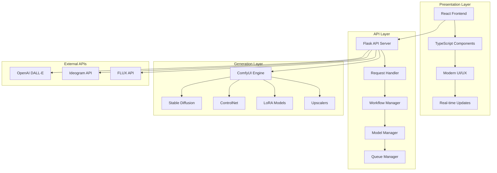
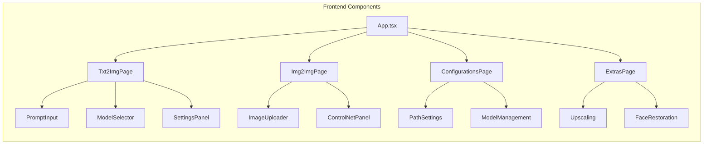
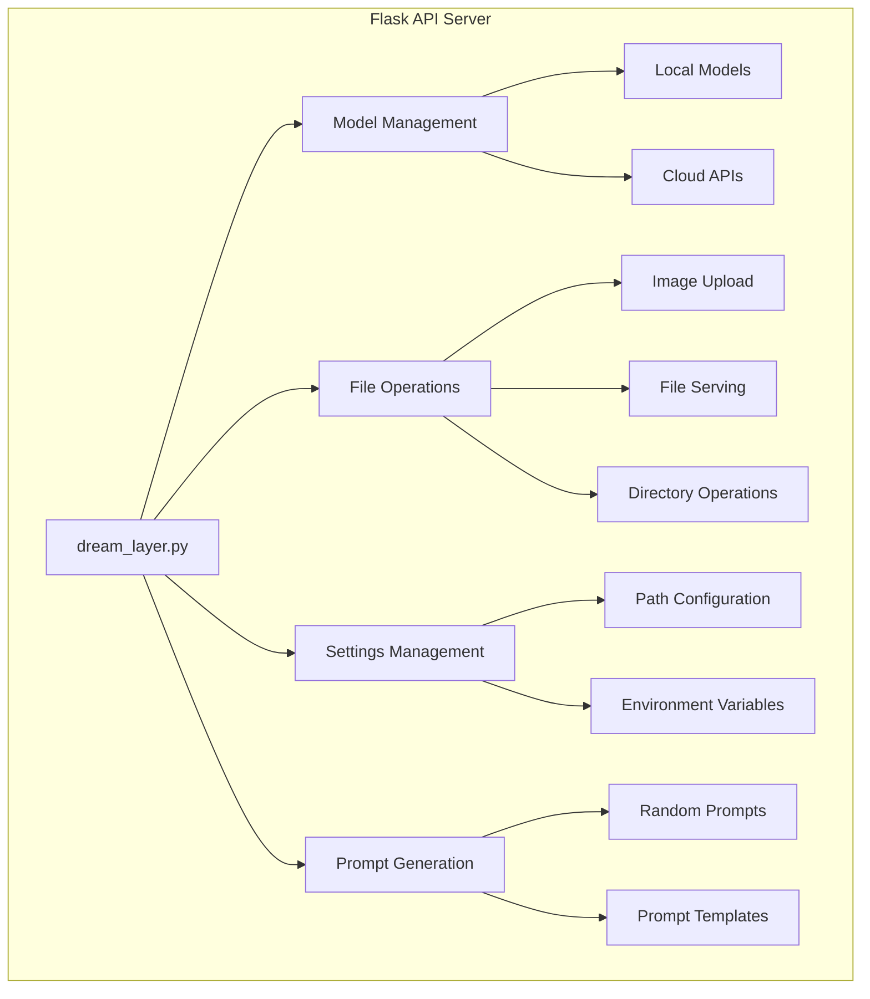
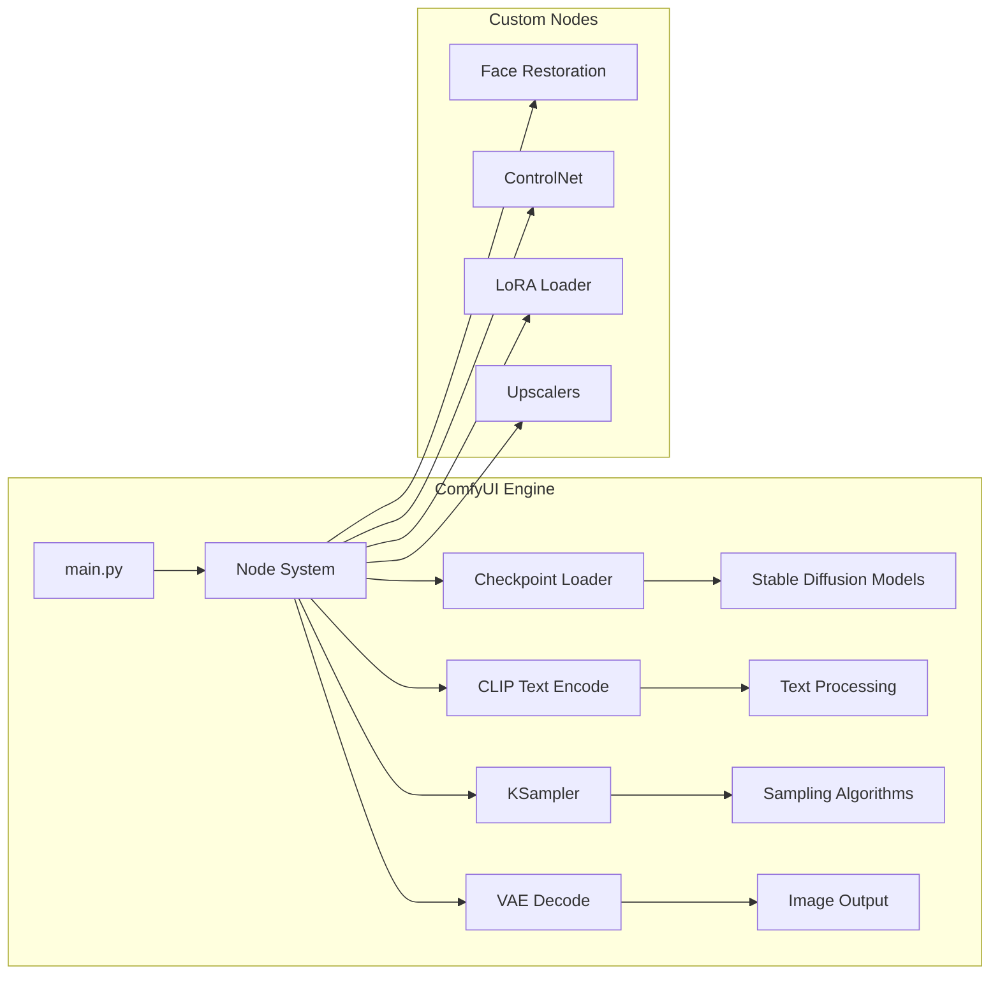
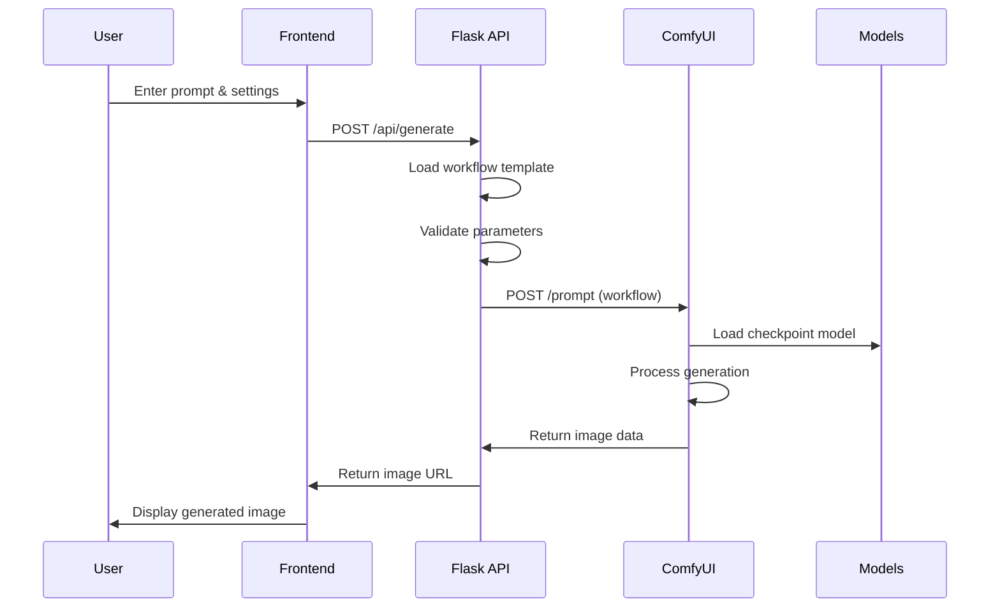
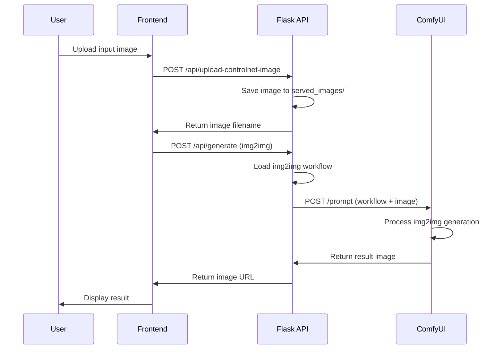
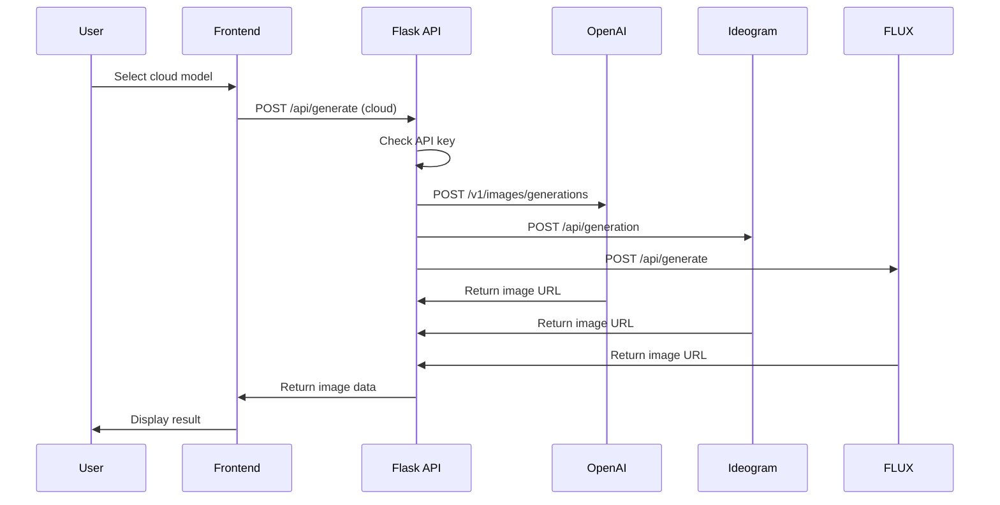
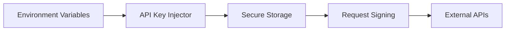
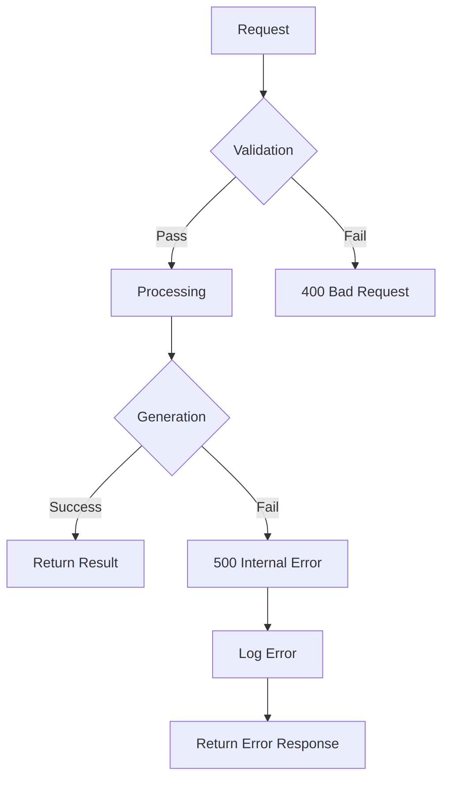

# Architecture

High-level system design and component architecture of DreamLayer AI with detailed flow diagrams and technical specifications based on the actual codebase.

## System Overview

DreamLayer AI follows a three-tier architecture pattern, separating concerns between presentation, business logic, and data generation layers.



## Component Architecture

### Frontend Layer (React/TypeScript)

The frontend is built with React and TypeScript, providing a modern, responsive interface.



**Key Components:**
- **`App.tsx`** - Main application component with routing
- **`Txt2ImgPage.tsx`** - Text-to-image generation interface
- **`Img2ImgPage.tsx`** - Image-to-image generation interface
- **`ConfigurationsPage.tsx`** - Settings and configuration management
- **`ExtrasPage.tsx`** - Advanced features (upscaling, face restoration)

### API Layer (Flask)

The Flask API server handles all backend operations and coordinates between frontend and generation engines.



**Core API Endpoints:**
- **`/api/models`** - Get available checkpoint models
- **`/api/lora-models`** - Get available LoRA models
- **`/api/upscaler-models`** - Get available upscaler models
- **`/api/controlnet/models`** - Get available ControlNet models
- **`/api/fetch-prompt`** - Get random positive/negative prompts
- **`/api/upload-controlnet-image`** - Upload ControlNet images
- **`/api/settings/paths`** - Configure output and models directories

### Generation Layer (ComfyUI)

ComfyUI serves as the core generation engine, handling all local model inference.



**Key Components:**
- **`main.py`** - ComfyUI server entry point
- **Node System** - Modular processing nodes
- **Checkpoint Loader** - Model loading and management
- **KSampler** - Diffusion sampling algorithms
- **VAE Decode** - Image decoding and output

## Data Flow

### Text-to-Image Generation Flow



### Image-to-Image Generation Flow



### Cloud API Integration Flow



## File Structure

```
DreamLayer/
├── dream_layer_backend/           # Flask API server
│   ├── dream_layer.py            # Main API server
│   ├── txt2img_server.py         # Text-to-image server
│   ├── img2img_server.py         # Image-to-image server
│   ├── controlnet.py             # ControlNet integration
│   └── dream_layer_backend_utils/ # Utility modules
│       ├── api_key_injector.py   # API key management
│       ├── fetch_advanced_models.py # Model fetching
│       └── random_prompt_generator.py # Prompt generation
├── dream_layer_frontend/          # React frontend
│   ├── src/
│   │   ├── App.tsx               # Main app component
│   │   ├── components/           # UI components
│   │   ├── features/             # Feature pages
│   │   ├── services/             # API services
│   │   ├── stores/               # State management
│   │   └── types/                # TypeScript types
│   └── public/                   # Static assets
├── ComfyUI/                      # ComfyUI engine
│   ├── main.py                   # ComfyUI server
│   ├── comfy/                    # Core modules
│   ├── custom_nodes/             # Custom nodes
│   └── models/                   # Model storage
├── workflows/                    # Pre-configured workflows
│   ├── txt2img/                  # Text-to-image workflows
│   └── img2img/                  # Image-to-image workflows
└── Dream_Layer_Resources/        # Output and resources
    ├── output/                   # Generated images
    └── served_images/            # Uploaded images
```

## Technology Stack

### Frontend
- **React 18** - UI framework
- **TypeScript** - Type safety
- **Vite** - Build tool and dev server
- **Tailwind CSS** - Styling
- **Shadcn/ui** - Component library

### Backend
- **Flask** - Web framework
- **Flask-CORS** - Cross-origin resource sharing
- **Requests** - HTTP client
- **JSON** - Data serialization

### Generation Engine
- **ComfyUI** - Node-based generation engine
- **PyTorch** - Deep learning framework
- **Transformers** - Model loading and inference
- **Diffusers** - Diffusion model utilities

### External Integrations
- **OpenAI API** - DALL-E 2/3 integration
- **Ideogram API** - Ideogram V3 integration
- **FLUX API** - FLUX Pro/Dev integration

## Security Architecture

### API Key Management


### CORS Configuration
```python
CORS(app, resources={
    r"/api/*": {
        "origins": ["http://localhost:8080"],
        "methods": ["GET", "POST", "OPTIONS"],
        "allow_headers": ["Content-Type"],
        "expose_headers": ["Content-Type"],
        "supports_credentials": True
    }
})
```

## Performance Considerations

### Memory Management
- **GPU Memory** - Automatic cleanup after generation
- **Model Loading** - Lazy loading of models
- **Image Caching** - Temporary storage of generated images

### Scalability
- **Multi-threading** - Concurrent request handling
- **Queue Management** - Generation job queuing
- **Resource Pooling** - Efficient resource utilization

### Optimization Strategies
- **Model Quantization** - Reduced memory usage
- **Batch Processing** - Multiple image generation
- **Caching** - Workflow and result caching

## Error Handling

### Error Flow


### Error Types
- **Validation Errors** - Invalid input parameters
- **Model Errors** - Model loading/inference failures
- **API Errors** - External API failures
- **System Errors** - Resource/configuration issues

## Monitoring and Logging

### Log Structure
```
logs/
├── dream_layer.log              # Main application logs
├── comfyui.log                  # ComfyUI engine logs
└── access.log                   # Request access logs
```

### Metrics
- **Generation Time** - Time per image generation
- **Success Rate** - Percentage of successful generations
- **Resource Usage** - CPU, GPU, memory utilization
- **API Response Time** - Endpoint response times

---

*For implementation details, see the [API Reference](api_reference.md) and [Usage Guide](usage.md).* 