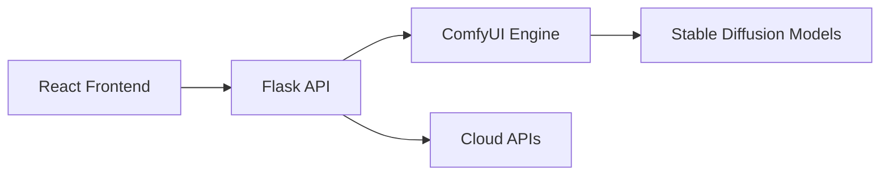

# DreamLayer AI Documentation

<!--- mkdocs:nav -->

Welcome to the comprehensive documentation for **DreamLayer AI** - The Cleanest, Fastest Stable Diffusion WebUI.

## 🚀 Quick Navigation

### Getting Started
- **[Quick Start Guide](quick_start.md)** - Get up and running in 60 seconds
- **[Installation Guide](installation.md)** - Complete setup instructions
- **[Usage Guide](usage.md)** - How to use DreamLayer effectively

### Technical Documentation
- **[Architecture](architecture.md)** - System design and component overview
- **[API Reference](api_reference.md)** - Complete API documentation
- **[Module Documentation](modules/)** - Detailed module guides

### Development
- **[Contributing](contributing.md)** - How to contribute to DreamLayer
- **[Changelog](changelog.md)** - Version history and updates

## 🎯 What is DreamLayer AI?

DreamLayer AI is a modern, open-source Stable Diffusion WebUI that combines the power of ComfyUI with a clean, intuitive interface. Built for AI artists, researchers, developers, and prompt engineers who demand both performance and usability.

### Key Features

- **🎨 Clean Interface** - Modern React-based UI with TypeScript
- **⚡ High Performance** - Optimized for speed and efficiency
- **🔧 Modular Architecture** - Easy to extend and customize
- **🌐 Multi-Model Support** - Local models + cloud APIs (DALL-E, Ideogram, FLUX)
- **🛠️ Advanced Features** - ControlNet, LoRA, upscaling, face restoration
- **📱 Responsive Design** - Works on desktop and mobile devices

### Architecture Overview

DreamLayer follows a three-tier architecture:

1. **Frontend Layer** - React/TypeScript UI components
2. **API Layer** - Flask-based REST API server
3. **Generation Layer** - ComfyUI integration for image generation



## 🏗️ System Components

### Core Modules

- **`dream_layer.py`** - Main Flask API server
- **`txt2img_server.py`** - Text-to-image generation server
- **`img2img_server.py`** - Image-to-image generation server
- **`controlnet.py`** - ControlNet integration
- **Frontend Components** - React/TypeScript UI

### Key Directories

- **`dream_layer_backend/`** - Python API server and utilities
- **`dream_layer_frontend/`** - React frontend application
- **`ComfyUI/`** - Integrated ComfyUI engine
- **`workflows/`** - Pre-configured generation workflows

## 🎨 Supported Models

### Local Models
- **Stable Diffusion** - All SD 1.5, 2.1, and XL variants
- **Custom Checkpoints** - Any compatible .safetensors files
- **LoRA Models** - Lightweight fine-tuned models
- **ControlNet** - Structure-guided generation
- **Upscalers** - ESRGAN, Real-ESRGAN, and more

### Cloud APIs
- **OpenAI DALL-E** - DALL-E 2 and DALL-E 3
- **Ideogram** - Ideogram V3
- **FLUX** - FLUX Pro and FLUX Dev

## 🚀 Getting Started

1. **Clone the repository**
   ```bash
   git clone https://github.com/DreamLayer-AI/DreamLayer.git
   cd DreamLayer
   ```

2. **Install dependencies**
   ```bash
   # macOS/Linux
   ./install_mac_dependencies.sh
   
   # Windows
   install_windows_dependencies.bat
   ```

3. **Start DreamLayer**
   ```bash
   # macOS/Linux
   ./start_dream_layer.sh
   
   # Windows
   start_dream_layer.bat
   ```

4. **Open your browser** to http://localhost:8080

For detailed instructions, see the [Quick Start Guide](quick_start.md).

## 🤝 Contributing

We welcome contributions! Please see our [Contributing Guide](contributing.md) for:

- Code style guidelines
- Development setup
- Pull request process
- Issue reporting

## 📄 License

DreamLayer AI is licensed under the GPL-3.0 License. See the [LICENSE](../LICENSE) file for details.

## 🔗 Links

- **[GitHub Repository](https://github.com/DreamLayer-AI/DreamLayer)**
- **[Issues](https://github.com/DreamLayer-AI/DreamLayer/issues)**
- **[Discussions](https://github.com/DreamLayer-AI/DreamLayer/discussions)**
- **[Releases](https://github.com/DreamLayer-AI/DreamLayer/releases)**

---

*Last updated: December 2024* 